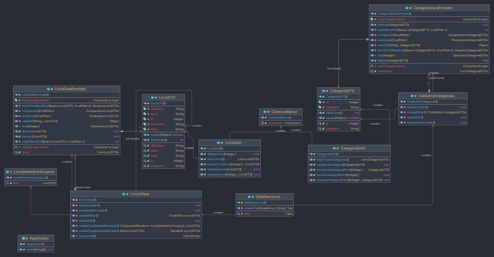

# Livraria do pacheco

### Caso de Uso: Gerenciamento de Livros em Livraria por categoria

**Objetivo:** O funcionário da livraria pode gerenciar livros e determinar sua categoria
**Cenário Principal:**

1. O funcionário da livraria acessa o sistema.
2. O funcionário navega até a seção de "Livros".
3. O funcionário pode escolher entre as seguintes opções:
- Adicionar livro .
- Editar informações de um livro.
- Excluir um livro.
- Listar todos os livros.
- Encontrar livro por ID.
4. Ao acessar a seção de "Categorias".
5. O funcionário pode escolher entre as seguintes opções:
- Adicionar categoria.
- Editar informações de uma categoria.
- Excluir uma categoria.
- Listar todas as categorias.
6. E apartir disso pode adicionar um livro e aderir a ele uma categoria.


### Diagrama de classes


## Informações

*Banco de dados* : MySQL;
<br>
*JDBC* : Mysql Connector 8.0.33;
<br>
*JAVA* : OpenJDK 20;

## Query
```sql


CREATE DATABASE IF NOT EXISTS livraria;
USE livraria;

-- Cria tabela

-- Criação da tabela livro com o campo categoria
CREATE TABLE IF NOT EXISTS livro (
                                   id INT AUTO_INCREMENT PRIMARY KEY,
                                   titulo VARCHAR(255) NOT NULL,
  autor VARCHAR(255) NOT NULL,
  descricao TEXT,
  categoria VARCHAR(50) NOT NULL
  );

-- Inserir registros fictícios na tabela livro com categorias
INSERT INTO livro (titulo, autor, descricao, categoria) VALUES
                                                          ('A Guerra dos Tronos', 'George R. R. Martin', 'O primeiro livro da série "As Crônicas de Gelo e Fogo", que inspirou a série de TV "Game of Thrones."', 'Fantasia'),
                                                          ('A Menina que Roubava Livros', 'Markus Zusak', 'Um livro que narra a história de Liesel Meminger, uma jovem que roubava livros durante a Segunda Guerra Mundial.', 'Drama'),
                                                          ('O Código Da Vinci', 'Dan Brown', 'Um thriller que mistura arte, religião e história, envolvendo um professor de simbologia em uma trama de conspirações.', 'Ação'),
                                                          ('O Hobbit', 'J.R.R. Tolkien', 'Uma aventura épica que precede "O Senhor dos Anéis" e segue Bilbo Bolseiro em sua jornada pela Terra-média.', 'Aventura'),
                                                          ('O Iluminado', 'Stephen King', 'Um clássico do horror que conta a história de Jack Torrance, um escritor que aceita um emprego de zelador em um hotel assombrado.', 'Terror'),
                                                          ('Crepúsculo', 'Stephenie Meyer', 'O primeiro livro da série "Crepúsculo", que segue a história de amor entre Bella Swan e Edward Cullen, um vampiro.', 'Romance'),
                                                          ('As Vantagens de Ser Invisível', 'Stephen Chbosky', 'Um romance que aborda temas como amizade, amor e a jornada de um adolescente introvertido.', 'Romance'),
                                                          ('A Revolução dos Anjos', 'José Eduardo Agualusa', 'Uma obra que explora as perspectivas de anjos, demônios e seres humanos na cidade de Luanda, Angola.', 'Drama'),
                                                          ('A Maldição do Tigre', 'Colleen Houck', 'O primeiro livro da série "A Saga do Tigre", que combina romance e aventura com mitologia hindu.', 'Fantasia'),
                                                          ('O Nome do Vento', 'Patrick Rothfuss', 'O início da trilogia "Crônica do Matador do Rei", que segue a vida de Kvothe, um jovem músico e mago.', 'Fantasia');


select * from livro

                use livraria;
-- Criação da tabela categoria
CREATE TABLE IF NOT EXISTS categoria (
                                       id INT AUTO_INCREMENT PRIMARY KEY,
                                       categoria VARCHAR(50) NOT NULL
  );

-- Inserir categorias iniciais
INSERT INTO categoria (categoria) VALUES
                                    ('Ação'),
                                    ('Aventura'),
                                    ('Comédia'),
                                    ('Drama'),
                                    ('Fantasia'),
                                    ('Ficção científica'),
                                    ('Romance'),
                                    ('Terror');


```

### O que eu utilizei?

Usei algumas partes dos conteudos que o professor passou, principalmente o JDBC para criar minha fabrica de conexções e 
poder manipular o banco de dados.
E o restanto foi muita leitura e tentar como que funciona o Vaadin, nesse caso utilizei a ultima versão disponivel do Vaadin Versão 24.
Demorei um pouco para entender(Ou pelo menos oque eu achei que entendi, mas no fim consegui executar o que eu queria usando o CRUD dele.)
<br>
